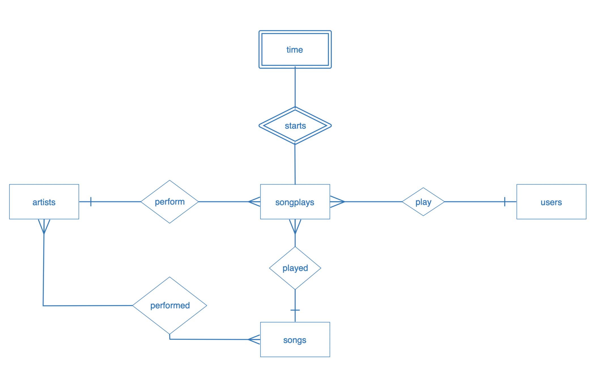

# Sparkify Database

**Name** `sparkifydb`

Discuss the purpose of this database in the context of the startup, Sparkify, and their analytical goals.
State and justify your database schema design and ETL pipeline.
[Optional] Provide example queries and results for song play analysis.

## Purpose

Sparkify is a database that will be served as the persistence compsonent for sparkify app. Application
for music player.
This database contains record song played by a particular user. This database also contains another tables equip to complete the persistence needed to another important process.

## Schema Design

**Entity Relationships diagram**

`songplays` table 
This table is needed to save songs plays by user

`users` table 
This table is keep the user detail data

`songs` table 
This table is keep the song detail that user can play

`artists` table 
This table is keep the artist detail that user can play their songs

`time` table 
This table is keep the starting time and time detail for each song played by a particular user

### `etl` design

The `etl` is design to be easy to maintain and modify. Every `etl` process is saved in `etl.py` file. Queries is saved in `sql_queries.py`. And database creation and initialization is in `create_tables.py`

All jupyter notebook files is used as a helper to test the etl.

